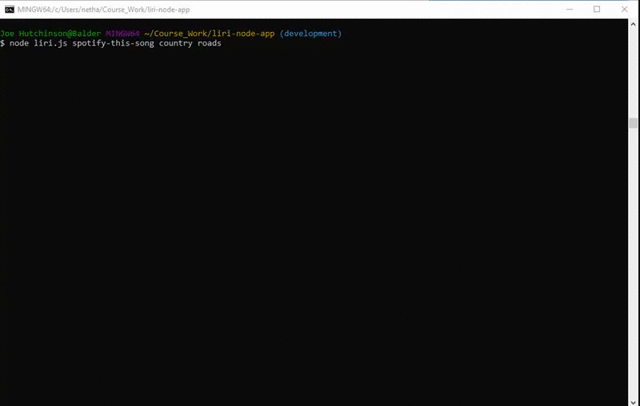

# liri-node-app - LIRI Bot

LIRI Bot is a program that can retrieve information about bands on tour, songs, and movies.  It takes in user inputs from a command terminal and pulls data from different API's based on these inputs in order to produce results.

For demonstrations of how each command works, please refer to the files found in the 'demonstration_files' folder.

Here is one example:




## Getting Started

This app is a command-based program that can be run on GitBash or Terminal; it is not run on a browser.  You will need to have VSCode or similar editor along with GitBash/Terminal.  Store all the files you download within the same folder.

You will also need to have your own API key and Secret ID# for Spotify.  These can be acquired by creating an account here: https://developer.spotify.com/dashboard/login

Once you have an account created and are logged in, go to the Dashboard section and click on "Create an App".  From here follow the directions and feel free to name the app whatever you like(e.g "LIRI Bot").  When you click on this app, you will be given a Client ID, and Client Secret.  It will be helpful to collect this information first before proceeding with installation.


### Prerequisites

The data can be pulled directly from GitHub via GitBash on PC or via Terminal on Mac.  If you are new to this process, please follow the directions below:

When you have accessed the repository page on GitHub, you may simply download a Zip file and extract it to a directory of your choosing.  Alternatively, you may download the data directly to your device via GitBash if you have an SSH key.  More on adding an SSH key can be found here: https://help.github.com/en/enterprise/2.15/user/articles/adding-a-new-ssh-key-to-your-github-account

To download via GitBash, once you have a working SSH key with GitHub, create a folder you wish to download data into.  Next, click on the green 'Download or Clone' button on the GitHub respoitory page.  Make sure you have SSH key selected(and not HTTPS), and click on the clipboard icon.  This copies the address to your clipboard.

Next, navigate to the folder you wish to download the data into via GitBash or Terminal, and then simply type "git clone" followed by the link you copied onto your clipboard(paste via ctrl/cmd+v).  Press the enter key, and GitBash will pull the entire repository into your folder.

Additionally, you will need to have Node.js installed.  This can be done here: https://nodejs.org/en/


### Installing

Once you have the repository cloned, you will need to install a number of npm packages before you can begin using the program.  You will also need to create a .env file in order to enable spotify to function with your Client ID and Client Secret numbers--more details on this below.

Begin with adding a folder for node_modules by typing the following in the command line: npm init

Next you will need to install each package used for LIRI Bot.  This can be done by typing each of the following into the command line:

* npm install
* npm install axios
* npm install --save node-spotify-api
* npm install moment
* npm install dotenv 

Finally, you will need to create a .env file and include the following information in the file:

```js
# Spotify API keys

SPOTIFY_ID=your-spotify-id
SPOTIFY_SECRET=your-spotify-secret

```

Replace all text after the = signs with your own Spotify Client ID and Secret ID.

You should now be ready to run LIRI Bot!


## Instructions

To use LIRI Bot, you will need to navigate to the exact same folder where the files are saved on GitBash/Terminal.  

Once there, you can initialize a LIRI Bot function by typing in: node liri.js + the command + whatever you wish to look up.

LIRI Bot can understand the following commands:

* concert-this

* spotify-this-song

* movie-this

* do-what-it-says

example: node liri.js movie this The Matrix

If you do not enter in a command, LIRI Bot will give you a message saying your entry was invalid, and will list each command accepted.  Be sure to type in the command exactly as shown above(with lower case and a dash between words).

The functions behave in the following manner:

### concert-this:
This command allows you to see if a band you like is currently on tour.  If the band is not on tour, you will receive a message stating as such(you need to tour more places, Trent...).  If the band is touring, each venue, location and date of the event will be listed. 

### spotify-this-song:

This command gives you data from Spotify on that song you really like.  Feel free to add the band's name in your search, especially if the song title is used by multiple bands.  LIRI Bot will list the artist, song title, provide a link to a preview of the song on spotify, and give you more details about the album the song was record on.

If you do not enter any song information, LIRI Bot will default to "The Sign" by Ace of Base.

### movie-this:

This command provides you with data on any movie you enter.  This data includes the title, release year, ratings, language, a plot synopsis and a list of the principle actors.

If you do not enter any movie information, LIRI Bot will default to the film "Mr. Nobody".

### do-what-it-says:

This command reads the contents of the random.txt file and runs it through the spotify-this-song command.  Enter in this command to find out what song is contained on the random.txt file.


## Testing

This program can be tested through use of the command console(GitBash/Terminal, etc.).  Simply add console.log under any section you wish to examine the results from in the console.  This was done extensively during development. 


##Deployment

Navigate to https://github.com/ to clone.  Carefully follow the installation instructions above.


## Built With

Visual Studio Code: https://code.visualstudio.com/  
Node.js: https://nodejs.org/en/


## Contributing

Feel free to fork the repository for your own study.  If you would like to learn more about how I constructed this project you may also message me via GitHub.


## Versioning

Use github for version control (https://github.com/your/project/tags).


## Author

* **Joe Hutchinson**


## Acknowledgments

Thank you Adam Minkus for reccomending Gyazo to create the video captures for this project.

* Joe Rehfuss
* Trae Shanks
* Lan Truong
* James Liu - thank you for the tip on concert-this not returning tours

Thank you again to my Coding Boot Camp instructors for all of the support and constructive feedback.